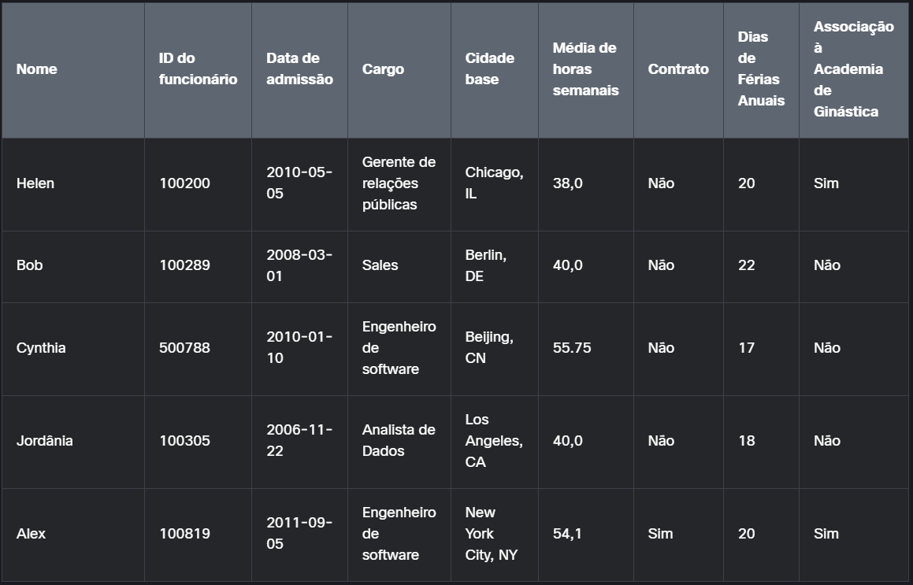
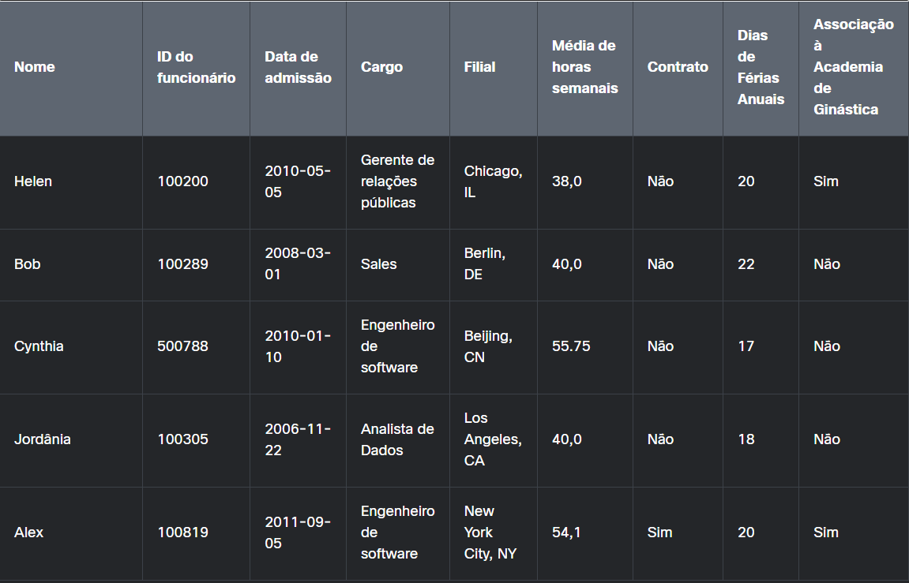

# **CURSO : INTRODUÇÃO À CIÊNCIA DE DADOS** #

>> ## Módulo01 - Análise de Experiência ( **1.2.1 - Dados Discretos x Dados Contínuos** ) ## 

## Transcrição : Dados Discretos x Dados Contínuos ##
 A análise de dados começa com a compreensão dos tipos de dados com os quais você está trabalhando, os dados também podem ser definidos como _quantitativos_ ou _qualitativos_. Os _dados quantitivos_ são descritivos, normalmente, são representados como texto, não numéricos, coletado por meio de pesquisas, questionários ou observações. E os _dados qualitativos_ são as avaliações coletadas sobre vários produtos, representados por valores de natureza numérica.
 Os dados quantitativos podem ser detalhados em dados discretos e contínuos. Os _dados **discretos**_ podem assumir apenas valores determinados, que são normalmente de origem aritmética, presente em valores ações financeiras ou quantidade de acessos em um website. Por outro lado, os dados **contínuos** são medidos e representados entre diferente formas, representado pelo cálculo de distância média percorrida por um veículo em constante movimento, a medida que o carro progride entre o trajeto.
 Resumidamente, é necessário compreender a diferença entre os dados **quantitativos** e dados **qualitativos**, e a importância em uso em situações que demandam da competência técnica do profissional.

-------------------------------------------------------------------------------

>> ## Módulo01 - Análise de Experiência ( **1.2.2 - Item Práticos : Dados Discretos x Dados Contínuos** ) ## 

### _Questões práticas_ ###
 Nosso cliente de loja de bicicletas está coletando dados para análise. Para cada exemplo, escolha se são dados discretos ou dados contínuos.

 1. _Número de funcionários em cada departamento_
    > Resposta : **Dados Discretos**

    - O número de funcionários em cada departamento é composto por dados discretos , pois tem um número limitado de valores possíveis.

 2. _Temperatura dentro de uma loja_
    > Resposta : **Dados Contínuos**

    - A temperatura dentro do armazém consiste em dados contínuos, pois a temperatura pode estar em um intervalo infinito de valores.

 3. _Distância percorrida por uma bicicleta em movimento_
    > Resposta : **Dados Contínuos**

    - A distância percorrida por uma bicicleta em movimento é um dado contínuo, pois o peso pode estar em um intervalo infinito de valores.

 4. _Número de clientes que compraram bicicleta este mês_
    > Resposta : **Dados Discretos**

    - O número de clientes que compraram bicicletas é um dado discreto porque tem um número limitado de valores possíveis.

 5. _Velocidade de um piloto em uma corrida_
    > Resposta : **Dados Contínuos**

    - A velocidade de um piloto em uma corrida de bicicleta consiste em dados contínuos, pois a velocidade do vento pode estar em um intervalo infinito de valores.

 6. _Quantidade de diesel comprada a cada semana_
    > Resposta : **Dados Discreto**

    - A quantidade de combustível diesel adquirida a cada semana para um caminhão de entrega consiste em dados discretos , pois tem um número limitado de valores possíveis.

---------------------------------------------------------------

>> ## Módulo01 - Análise de Experiência ( **1.2.3 - Tipos de Dados** ) ## 

## Descrição - Tipos de Dados ##
 Todos os dados têm um recurso chamado tipo de dados que informa às aplicações como tratá-los.As operações realizadas são definidas pelo tipo de dados. Identificar os tipos de dados é útil na análise, pois podemos precisar agrupar os dados, classificar os dados ou executar cálculos nos dados. Os dados devem ser agrupados por determinado tipo para realizar as operações necessárias. Por exemplo, considere a seguinte tabela de informações dos funcionários do Data Crunchers.

 - _Tabela de Informações - Funcionários_

    | **NOME** | **ID** | **ADMISSÃO** | **CARGO** | **NACIONALIDADE** | **MÉDIA DE HORAS** | **CONTRATO** | 
    |  -   |   -   |   -   |   -   |   -   |   -   |    -   |   
    | Helen | 0200 | 2009-10-20 | Gerente | Estadunidense | 45,5 | Ativo |
    | Bob | 0210 | 2008-03-01 | Auxiliar | Colombiano | 30,0 | Ativo
    | Alex | 0132 | 2002-05-19 | Diretor | Argentino | 55,0 | Ativo
    | Cythia | 0250 | 2013-07-14 | Operária | Estadunidense | 0,0 | Suspenso 

 Cada coluna (ou campo) na tabela Informações dos Funcionários tem dados do mesmo tipo. A tabela a seguir descreve os vários tipos de dados. Leia as descrições de cada tipo de dados. Compare-os com os dados exibidos na tabela Informações do funcionário e pense em qual tipo é cada campo (por exemplo, Cargo contém dados de string). 

 - _Tipos de Dados_

    - String
        - Caracteres 

    - Números inteiros
        - Números inteiros

    - Floating Point
        - Números com casa decimais

    - Data e Hora
        - Localização com calendário

    - Booleans
        - Valores lógicos 

---------------------------------------------------------------------

>> ## Módulo01 - Análise de Experiência ( **1.2.4 - Item Prático : Tipo de Dados** ) ##

### _Questões Práticas_ ###
 Consulte a tabela de informação do funcionário. Você recebeu a tarefa de definir os tipos de dados corretos que podem ser armazenados em cada uma das colunas abaixo. Para cada nome de coluna na tabela Informações dos Funcionários, selecione o tipo de dados correto. Cada tipo de dados pode ser usado mais de uma vez.

 

 1. _NOME_
    > Resposta : **String ( Caractere )**

 2. _ID_ 
    > Resposta : **String ( Caractere )**

 3. _DATA DE ADMISSÃO_
    > Resposta : **Date / Hour**

 4. _CARGO_
    > Resposta : **String ( Caractere )**

 5. _NACIONALIDADE_
    > Resposta : **String ( Caractere )**

 6. _MÉDIA DE HORAS TRABALHADAS_
    > Resposta : **Float ( Número Decimal )**

 7. _CONTRATO_
    > Resposta : **Boolean ( Operador Lógico )**

 8. _DIAS DE FÉRIAS_
    > Resposta : **Integer ( Número Inteiro )**

 9. _ASSOSCIAÇÃO ACADÊMICA_
    > Resposta : **Boolean ( Operador Lógico )**

--------------------------------------------------------------------------

>> ## Módulo01 - Análise de Experiência ( **1.2.5 - Variedade de Dados** ) ##

## Descrição - Variedade de Dados ##
 Os dados estão ao nosso redor e estão chegando em taxas cada vez maiores e em muitos formatos diferentes. Por exemplo, quando os telefones celulares se tornaram populares, eles tinham apenas alguns megabytes de armazenamento de dados e estavam limitados à variedade de dados que podiam armazenar. Esses primeiros telefones celulares, usados principalmente para chamadas telefônicas, podiam manter mensagens de texto, alguns arquivos de música MP3 e algumas fotos em baixa resolução. Os telefones celulares modernos podem ter até um terabyte (1.000 gigabytes) de armazenamento. Eles podem armazenar uma variedade cada vez maior de tipos de dados, incluindo arquivos de vídeo de alta definição, fotografias, arquivos de áudio, documentos, aplicativos, livros, calendários e e-mails, para citar alguns.

----------------------------------------------------------------------------

>> ## Módulo01 - Análise de Experiência ( **1.2.6 - Dados Estruturados x Dados Non-Estruturados** ) ##

## Descrição - Dados Estruturados x Não Estruturados ##
 Para processar, armazenar e analisar todos esses diferentes tipos de dados, é importante pensar se são dados estruturados ou dados não estruturados. Selecione cada tipo de dados paara obter mais informações.

### _Dados Estruturados_ ###
 Os dados estruturados compõem cerca de 10% a 20% dos dados gerados e têm tipos e padrões de dados claramente definidos que os tornam facilmente armazenados e organizados em colunas e linhas. Essa organização facilita a busca e análise de dados estruturados. As fontes de dados estruturados incluem registros de vendas, sistemas de reservas de companhias aéreas e controle de inventário. Os dados estruturados geralmente são armazenados em bancos de dados relacionais, como bancos de dados Structured Query Language (SQL) ou em planilhas como o Microsoft Excel.  

### _Dados Não-Estruturados_ ###
 Os dados não estruturados compõem a maioria dos dados gerados, cerca de 80%, e não podem ser organizados em linhas e colunas. Isso dificulta a pesquisa, o gerenciamento e a análise de dados não estruturados. As fontes de dados não estruturados incluem imagens, PDFs, dados de sensores e postagens em mídias sociais. Os dados não estruturados geralmente são armazenados em um banco de dados não relacional, também conhecido como banco de dados NoSQL.

----------------------------------------------------------------------------

>> ## Módulo01 - Análise de Experiência ( **1.2.7 - Item Prático : Dados Estruturados x Dados Non-Estruturados** ) ##

### _Questões Práticas_ ###
 Para cada exemplo de dados, escolha se eles representam dados estruturados ou dados não estruturados.

 1. _Planílhas_
    > Resposta : **Dados Estruturados*

 2. _Publicações em Mídia Social_
    > Resposta : **Dados Não-Estruturados**

 3. _Transações de Vendas_
    > Resposta : **Dados Estruturados**

 4. _Vídeo de Vigilânicia_
    > Resposta : **Dados Não-Estruturados**

 5. _Bancos de Dados Relacionais_
    > Resposta : **Dados Estruturados**

 6. _Número de Cartão de Crédito_
    > Resposta : **Dados Estruturado**

 7. _Mensagens de Email_
    > Resposta : **Dados Não-Estruturados**

    - Os dados estruturados são compostos por tipos de dados definidos e são altamente organizados com padrões facilmente pesquisáveis. Bancos de dados relacionais, planilhas, transações de vendas e números de cartão de crédito são exemplos de dados estruturados.

    - Os dados não estruturados não são estruturados por meio de um modelo ou esquema de dados predefinido. Geralmente são dados qualitativos e melhor gerenciados em bancos de dados não relacionais (NoSQL). Mensagens de e-mail, postagens em mídias sociais e vídeos de vigilância são exemplos de dados não estruturados. 
    
---------------------------------------------------------------------------

>> ## Módulo01 - Análise de Experiência ( **1.2.8 - Seleção de Dados Relevantes** ) ##

## Descrição - Seleção de Dados Relevantes ##
 A seleção de dados relevantes começa com a definição da pergunta que você deseja responder. Por exemplo, suponha que você esteja investigando os fatores que contribuem para o bem-estar geral dos funcionários. Você pode começar analisando os dados disponíveis e determinando quais campos ou medidas são relevantes para sua pergunta. Na tabela de Informações dos Funcionários, copiada abaixo, a Data de Contratação não tem impacto na saúde dos trabalhadores e, portanto, é irrelevante para a análise. Por outro lado, o excesso de trabalho pode afetar o bem-estar dos funcionários e, Por outro lado, o excesso de trabalho pode afetar o bem-estar dos funcionários e, portanto, a Média de Horas Semanais pode ser relevante para a sua pesquisa.

------------------------------------------------------------------------------

>> ## Módulo01 - Análise de Experiência ( **1.2.9 - Item Prático : Seleção de Dados Relevantes** ) ##

### _Questões práticas_ ###
 Consulte a tabela de informações do funcionário abaixo. Um dos clientes da _Data Crunchers_ é uma grande empresa nacional com várias filiais. Você está coletando dados para ajudar a preparar um relatório sobre o **bem estar geral da força de trabalho**. O relatório será apresentado na reunião anual com os gerentes das filiais e precisa ter os dados de bem-estar dividios por filial.
 Selecione se os dados nas colunas na tabela Informações dos Funcionários são relevantes ou não relevantes para o relatório de bem-estar dos funcionários. ( OBS: A coluan referente a "_Cidade Base_" foi alterada para "_Filial_")

 

 1. _NOME_
    > Resposta : **NÃO RELEVANTE**

 2. _ID_ 
    > Resposta : **NÃO RELEVANTE**

 3. _DATA DE ADMISSÃO_
    > Resposta : **NÃO RELEVANTE**

 4. _CARGO_
    > Resposta : **NÃO RELEVANTE**

 5. _FILIAL_
    > Resposta : **RELEVANTE**

 6. _MÉDIA DE HORAS TRABALHADAS_
    > Resposta : **RELEVANTE**

 7. _CONTRATO_
    > Resposta : **NÃO RELEVANTE**

 8. _DIAS DE FÉRIAS_
    > Resposta : **NÃO RELEVANTE**

 9. _ASSOSCIAÇÃO ACADÊMICA_
    > Resposta : **RELEVANTE**

    - Correto! Como o estudo precisa mostrar dados de bem-estar por filial, os dois campos a serem incluídos são filial e associação à academia. Os outros campos não são relevantes porque não fornecem insights sobre bem-estar nem ajudam a identificar a localização da filial. 
