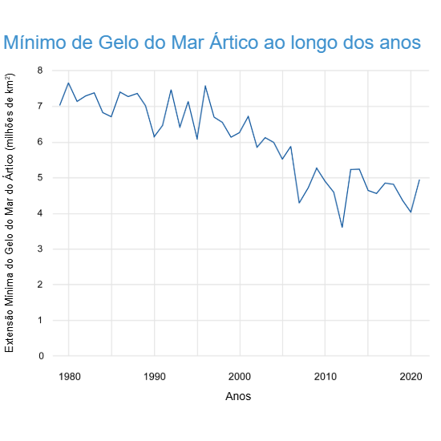
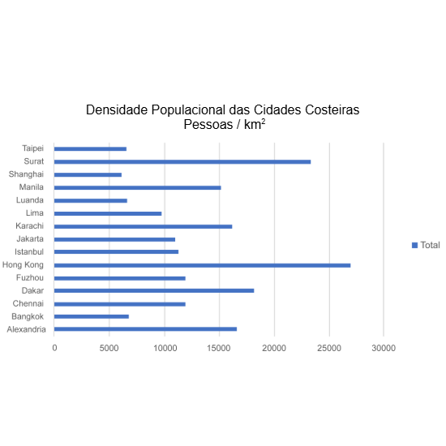

# **CURSO : INTRODUÇÃO À CIÊNCIA DE DADOS** #

>> ## Módulo01 - Análise de Experiência ( **1.3.1 - Análise de Dados para Insights de Negócios** ) ##

## Transcrição em Vídeo : Análise de Dados para Insights de Negócios ##
 A ciência de dados permite que as empresas compreendam melhor o impacto que seus produtos e serviços causam, ajustando-os para aprimorar métodos, atualizar métricas e ofercer suporte em cada prestação de serviço realizada. Os insights obtidos com a análise de dados podem fazer trazer sucesso e êxtase à organização, junto ao desempenho e experiência de seus colaboradores.
 Existem várias tipos de análise que fornecem informações que podem impulsionar a inovação, melhorar a eficiência e mitigar possíveis riscos, potencializando e aprimorando os pilares essências de uma organização. O tipo de análise a ser implementado dependerá do problema que precisa ser solucionado ou das perguntas que devem ser atendidas. A análise de tendências é uma maneira de obter insigths sobre os principais indicadores de desempenho ( **KPI** ), conforme o período de funcionamento da corporação.
 Uma demonstração deste processo anallítico é através do nosso clinete, 'Data Crunchers', uma loja de bicicletas que apresentou dificuldades ao atrair novos clientes. Um ponto que podemos usar para análise são os diferentes tipos de produtos ou prestações de serviços que foram consumidos em serviços anteriores, e visualizar o período em que estas negociações aconteceram. 
 Essa análise identifica as possíveis tendências dentro das situações apresentadas, de acordo com os níveis comparativos mencionados anteriormente. Em seguida, o gerenciamento da loja pode analisar os dados coletados para determinar a eficácia de publicidade. A análise também pode prever os comportamentos e experiências relatada por consumidores, projetando uma medição de satisfação de usuários e padrões que podem ser utilizados para treinamento otimizado de máquinas para executar operações complexas.

----------------------------------------------------------------------------

>> ## Módulo01 - Análise de Experiência ( **1.3.2 - Item Prático : Análise de Dados para Business Insights** ) ##
 
### _Questões Práticas_ ###

 1. _Uma concessionária de carros contratou um analista de dados para analisar as tendências e aumentar as vendas de carros novos. O resultado da análise recomendou que a concessionária comprasse anúncios em jornais e televisão durante períodos específicos para atingir novos compradores. Quais são as duas tendências de análise que apoiariam essa estratégia? (Escolha duas.)_

    > Resposta : **O tipo de carro ou serviço adquirido por novos clientes || A época do ano anterior que os novos clientes fizeram compras**

    - A análise de tendências é uma maneira de obter insights sobre os principais indicadores de desempenho (KPI) ao longo do tempo. O analista pode analisar os tipos de carros ou serviços que os novos clientes anteriores compraram e durante a época do ano em que fizeram as compras. Essa análise identifica tendências nessas compras, como muitos novos clientes estão comprando determinados tipos de carros em épocas específicas do ano. Os resultados da análise forneceriam uma estratégia para a concessionária comprar publicidade durante esses períodos para direcionar novos compradores. Em seguida, a gerência pode analisar os dados de vendas para determinar a eficácia da publicidade. 

--------------------------------------------------------------------------

>> ## Módulo01 - Análise de Experiência ( **1.3.3 - Insights humanitários a partir da Análise de Dados** ) ##

As empresas não são as únicas beneficiárias da explosão em dados e análises. Reproduza o vídeo para saber mais sobre como as empresas humanitárias usam dados para tomar decisões sobre recursos. 

## Transcrição do Vídeo : Insights huminitários da Análise de Dados ##
 As empresas não são as únicas que se beneficiam da análise. Há muitos exemplos de como as organizações huminitárias estão utilizando o poder existente da coleta de dados para oferecer suporte e auxílio em situações necessárias. 
 As organizações de ajuda humanitária utilizam insights obtidos com a análise de dados para prever os impactos de eventos climáticos, essas informações permitem que reúnam recursos apropriados para minizar o impacto de populações vulneráveis. A captura de dados como satélites, sensores, câmeras e publicações em mídias sociais compartilham informaçõe sobre a quantidade numérica de afetados e os locais deslocados que solicitam por ajuda. Os dados coletados durante o recente cenário epidêmico informou aos pesquisadores e profissionais de saúde como ocorre as transmissões, os efeitos e as respectivas mutações do vírus "SARAV COVID-19"...possibilitando um maior entendimento técnico e científico sobre os detalhes e descrições do vírus. Além disso, ferramentas como sensores de IOT e diferentes objetos, permitem que os empreendedores sociais determinem o funcionamento de aparelhos e possibilitam prever problemas futuros.

--------------------------------------------------------------------------

>> ## Módulo01 - Análise de Experiência ( **1.3.4 - Exemplos Sociais** ) ##

## Descrição ##
 O Escritório das Nações Unidas para a Coordenação de Assuntos Humanitários (OCHA) fornece serviços de gerenciamento de informações para a comunidade humanitária por meio da coleta e compartilhamento de dados. Ao compartilhar os dados e a análise, o OCHA permite a coordenação de recursos, tomada de decisão e financiamento. O Humanitarian Data Exchange (HDX) é uma fonte que fornece aos funcionários das Nações Unidas, (ONU), organizações não governamentais (ONGs), governo e universidades as ferramentas para melhorar o compartilhamento de dados durante tempos de crise.  
 
 A disponibilidade de dados permite que as empresas ajudem melhor as áreas afetadas por crises. A análise preditiva pode concentrar os esforços humanitários em ações preventivas, em vez de reativas. Existem empresas, como a DrivenData ( https://www.drivendata.org/ ), que ajudam grupos humanitários e de impacto social a encontrar respostas baseadas em dados para perguntas difíceis. 

 As competições realizadas pela DrivenData incentivam os profissionais de dados a encontrar soluções para problemas do mundo real. Uma dessas competições desafia os participantes a prever o nível de danos causados por terremotos de acordo com os aspectos de localização e construção do edifício. Essas informações podem ajudar os planejadores a determinar, com antecedência, quais edifícios podem resistir a um terremoto e quais podem precisar de medidas preventivas. Todas as soluções premiadas são disponibilizadas como código aberto para qualquer pessoa aprender ou desenvolver.

--------------------------------------------------------------------------

>> ## Módulo01 - Análise de Experiência ( **1.3.5 - Item Prático - Exemplos Sociais** ) ##

### _Questões práticas_ ###
 
 1. _Um cientista de dados deseja usar os dados no gráfico à direita para prever as mudanças no nível do mar **ao longo do tempo** e como essas mudanças podem afetar as pessoas **que moram em cidades litorâneas** em todo o mundo. Quais das seguintes informações podem ajudar a estabelecer como a área de gelo marinho do Ártico está relacionada ao impacto das inundações costeiras?_

    - Fonte: [National Oceanic and Atmospheric Association](https://www.climate.gov/news-features/understanding-climate/climate-change-arctic-sea-ice-summer-minimum)

    

    > Resposta : **Um gráfico que mostra o crescimento populacional previso para cidades litorâneas || Informações de governos sobre seus planos de mitigar os efeitos do aumento do nível do mar nas populações**

    - Correto! O cientista de dados utilizará os dados sobre o crescimento futuro da população e os planos governamentais de mitigação para avaliar os impactos das inundações.

--------------------------------------------------------------------------

>> ## Módulo01 - Análise de Experiência ( **1.3.6 - Exemplo Ambiental ( Mudança Climática )** ) ##

## Descrição ##
 Um dos usos mais visíveis da análise de dados são as observações e previsões em andamento relacionadas às mudanças climáticas e seus impactos na sociedade. Estes são possíveis coletando e analisando dados de muitas fontes, incluindo satélites, sensores de temperatura no oceano, sensores de qualidade do ar, produtividade de culturas e dados climáticos. As observações descobertas pelos profissionais de dados em todo o mundo estão mudando a maneira como vemos nossas interações com nosso ambiente, estimulando ações para combater os efeitos nocivos que podem resultar de um aquecimento climático. Sem esse esforço analítico intensivo, não conseguiríamos imaginar as mudanças e coordenar os esforços para mitigar os possíveis danos.
 
 Vários painéis públicos interativos mostram os impactos das mudanças climáticas, incluindo o IMF Climate Change Dashboard e o NOAA Global Climate Dashboard. Acesse estes painéis para ver o trabalho realizado pelos profissionais de dados dessas empresas para ajudar o público a visualizar as mudanças ao longo do tempo. 

 - Fonte : [IMF - Climate Change Dashboard](https://climatedata.imf.org/pages/climatechange-data)  

--------------------------------------------------------------------------

>> ## Módulo01 - Análise de Experiência ( **1.3.7 - Item Prático : Exemplo Ambiental ( Mudança Climática )** ) ##

### _Questões Práticas_ ###
 
 - _Um cliente da Data Crunchers, Pickard Climate Research, deseja obter financiamento para estudar o impacto do **aumento do nível do mar** nas cidades costeiras e nas pessoas **que nelas vivem**. Eles estão especialmente preocupados com as cidades com uma **densidade populacional muito alta**, o que dificulta a realocação em caso de emergência. A densidade populacional é determinada dividindo-se a população pela área. Use o gráfico na figura para determinar onde o cliente deve focar seus esforços._

    

    1. _Quais informações estão prontamente disponíveis usando a visualização mostrada na figura?_

        > Resposta : **As duas cidades com maior densidade populacional**

        - Correto! A Pickard Climate Research pode concentrar seus recursos nas duas principais cidades. 

    2. _Este gráfico de barras torna difícil classificar cidades com densidades semelhantes e calcular valores. Certifique-se de que a visualização inclua todas as informações necessárias para fornecer as informações solicitadas. Qual ação tornaria este gráfico mais benéfico para nosso cliente de ciência climática?_

        > Resposta : **Classificar as cidades por ordem de densidade**
        
        - Correto! Ordenar as cidades pela sua densidade facilitará muito a determinação do ranking! A Pickard Climate Research apreciará seu trabalho! 

--------------------------------------------------------------------------

>> ## Módulo01 - Análise de Experiência ( **1.3.8 - Laboratório Gráfico** ) ##

## Descrição ##
 A Data Crunchers acaba de trazer um novo cliente, Cool Treats Ice Cream. Eles gostariam de adotar uma abordagem baseada em dados para administrar seus negócios. Como novo membro da equipe Data Crunchers, este projeto "legal" é sua nova tarefa. O objetivo é ajudar a Cool Treats Ice Cream a descobrir o quão bem seus vários sabores de sorvete vendem e como otimizar o momento de fazer novos lotes. Para isso, você usará planilhas e gráficos dinâmicos. Não se preocupe se você não sabe muito sobre gráficos dinâmicos. É sobre isso que você aprenderá nos três laboratórios a seguir. Deixe-nos orgulhosos de você!

