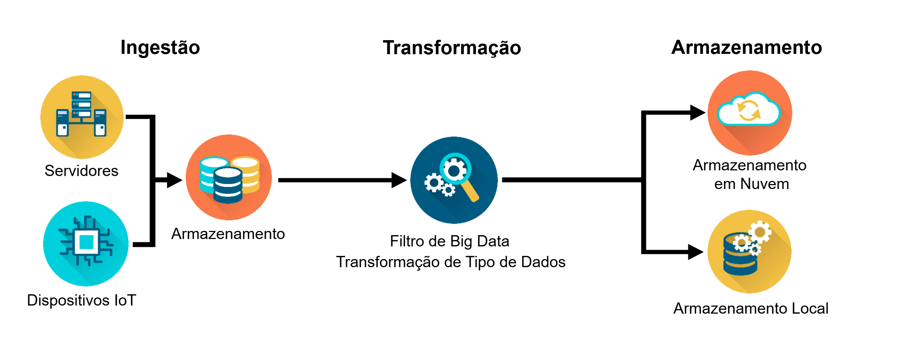

# **CURSO : INTRODUÇÃO À CIÊNCIA DE DADOS** #

>> ## Módulo02 - Coleta e Armazenamento de Dados ( **2.1.1 - Pipelines de Dados** ) ##

## Descrição ##
 O uso de todos esses dados para obter esses benefícios em potencial exige o gerenciamento dos dados. Os engenheiros de dados são os profissionais que participam desse gerenciamento. Esse processo inclui o desenvolvimento de infraestrutura e sistemas para ingerir os dados, limpá-los, transformá-los e, por fim, armazená-los de forma a facilitar o acesso e a consulta dos dados para o restante das pessoas na empresa para responder a perguntas comerciais. 

 O que é um pipeline de dados? A melhor abordagem é pensar em um pipeline de dados para entender melhor o que os engenheiros de dados fazem com os dados. Você pode pensar nisso quase como água fluindo através de canos. Para entender o que os engenheiros de dados fazem com esses dados, considere a figura abaixo, que é uma representação simplificada dos dados que fluem pelas três fases de um pipeline de dados: **ingestão, transformação e armazenamento ( Extract | Transform e Load )**.

 Observação: você também verá o acrônimo ETL, que significa Extract, Transform e Load. A extração é equivalente à ingestão e o armazenamento é equivalente à carga.

 

### _Processamento_ ###
 Os engenheiros de dados vão querer ingerir duas fontes principais de dados: lotes de dados de servidores ou bancos de dados (**ingestão de lote**), e eventos em tempo real que acontecem no mundo e streaming do mundo dos dispositivos (**ingestão de streaming**). 
 Um exemplo de ingestão em lote é uma empresa de jogos que deseja examinar a relação entre renovações de assinatura e tíquetes de suporte ao cliente. Ele pode ingerir todos os dados relacionados diariamente ou semanalmente. Ele não precisa acessar e analisar os dados imediatamente após o fechamento de um tíquete de suporte ou a renovação de uma assinatura. 
 Um exemplo de ingestão de streaming é quando você solicita uma carona de um serviço de compartilhamento de carona. A empresa combina fluxos de dados (por exemplo, dados históricos, dados de tráfego em tempo real e rastreamento de localização) para garantir que você obtenha uma carona do motorista que estiver mais próximo de você no momento. 

### _Transformação_ ###
 Depois de hospedar os dados ingeridos em um armmazenamento temporário, estamos prontos para começar, certo? Bem, não exatamente. Os dados quase sempre precisam ser transformados para serem úteis para análises posteriores. Há duas questões principais a serem tratadas aqui. Primeiro, **os dados geralmente precisam ser limpos**: valores ausentes, as datas podem estar no formato errado e os dados ficam desatualizados rapidamente: você pode ter coletado dados sobre pessoas que mudaram de função ou de empresa. 

 A outra Pergunta importante envolve a **transformação dos dados** para que a estrutura se alinhe com o sistema necessário para permitir análises precisas. Por exemplo, você pode querer descobrir os produtos mais vendidos da sua empresa todos os meses. Mas os dados podem conter apenas a data de venda de cada produto. Você precisaria transformar os dados criando, por exemplo, uma variável de número de vendas por mês.

### _Armazenamento_ ###
 Depois de transformar os dados, eles precisam ser armazenados em locais e formulários, facilitando para os analistas a execução de relatórios sobre vendas semanais e para os cientistas de dados para criar modelos de recomendação preditivos. Segurança de dados ou gerenciamento de acesso a dados para que as pessoas que devem acessar os dados possam acessar de forma eficiente e impedir a entrada de pessoas que não devem.   

 Há dois locais principais para as empresas **armazenarem os dados: no local ou na nuvem**. Muitas vezes, as empresas usam um híbrido de ambos.

 O termo “local” se refere ao hardware nos servidores e na infraestrutura de uma empresa, geralmente fisicamente no local. No passado, o armazenamento local era a única opção disponível para armazenar dados. A empresa implantaria mais servidores à medida que as necessidades de armazenamento aumentassem. Com o tempo, as empresas tiveram salas inteiras ou data centers com servidores que hospedavam os bancos de dados que armazenavam todos os dados. Esse modelo tinha custos diretos significativos para hardware e licenças para servidores e custos indiretos de energia, resfriamento e serviços de backup externos. A empresa também deve manter a equipe de TI à disposição para manter e gerenciar os servidores.

 Hoje, no entanto, as empresas estão migrando cada vez mais o armazenamento de dados para a nuvem. O armazenamento em nuvem parece misterioso, mas significa apenas armazenar dados em servidores mantidos por provedores como Amazon Web Services (AWS), Microsoft Azure, Google Cloud Platform (GCP) e Alibaba Cloud. O provedor de serviços em nuvem compra, instala e mantém todo hardware, software e infraestrutura de suporte em seus centros de dados. Ao usar os serviços em nuvem, uma empresa evita os enormes custos de criação e suporte da infraestrutura necessária para armazenar as grandes quantidades de dados que coletam. Em vez disso, o provedor de serviços em nuvem cobra uma taxa de assinatura de "pagamento pelo uso" (mensal).
