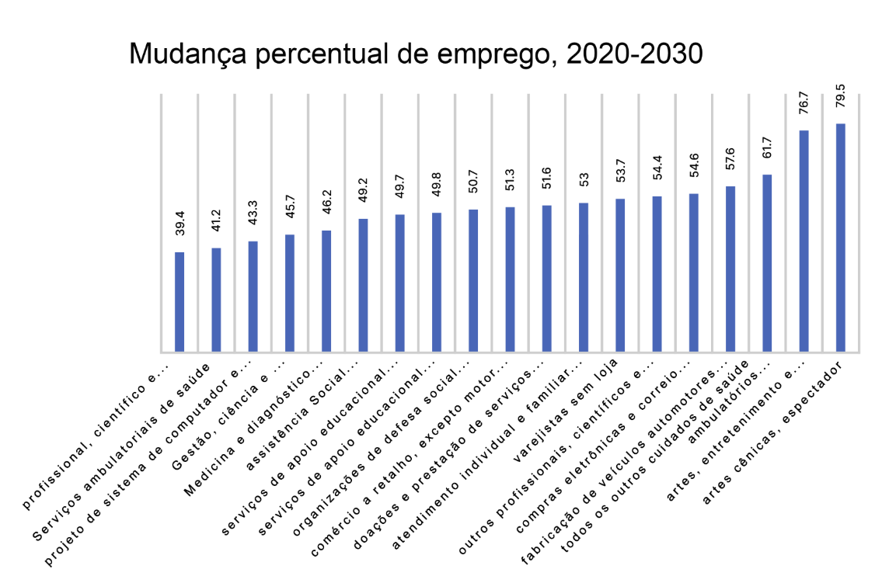

# **CURSO : INTRODUÇÃO À CIÊNCIA DE DADOS** #

>> ## Módulo04 - Carreira em Análise de Dados( **4.0.1 - Introdução às funções de trabalho em Ciência de Dados** ) ##

## Transcrição - "Introdução às Funções de Ciência de Dados" ##
 Foi ótimo tê-lo aqui trabalhando conosco na Data Crunchers nos últimos dias. Gostaria de ter a oportunidade de revisar com você o que você vivenciou e conversar um pouco sobre seus planos futuros.
 Queremos garantir que seu estágio o impulsione em direção aos seus objetivos de carreira. Você teve a chance de ver como dados e análises estão mudando quase todos os aspectos de nossas vidas.  Existem muitas oportunidades para você se envolver e começar. Vamos discutir alguns dos cargos disponíveis e como você pode se preparar para assumi-los.

------------------------------------------------------------

>> ## Módulo04 - Carreira em Análise de Dados( **4.0.1 - Introdução às funções de trabalho em Ciência de Dados** ) ##

## Descrição ##
 Neste módulo, você iniciará sua carreira em análise de dados, aprendendo sobre o mercado de trabalho e a importância de um portifólio de projetos.

 - _Tópico - Preparação de Carreira em Análise de Dados_ 
    - Diferenciar os tipos de funções em análise de dados

 - _Tópico - Próximos Passos_
    - Explicar as próximas etapas necessárias para criar um portifólio com habilidades em análise de dados

---------------------------------------------------------

>> ## Módulo04 - Carreira em Análise de Dados( **4.0.2 - Preparação para um carreira profissional"** ) ##

## Descrição ##
 Ao longo deste curso, você viu como os dados se transformam, de fatos brutos, medições ou observações, em insights valiosos para empresas e organizações humanitárias. Profissionais de dados talentosos realizam esse trabalho. Embora haja alguma sobreposição entre as responsabilidades, os profissionais de dados desempenham três funções principais nas empresas.

 ### _Analista de Dados_ ###
  Os analistas de dados consultam, processam, fornecem relatórios, resumem e visualizam dados. Eles aproveitam as ferramentas e os métodos atuais para resolver um problema. Eles ajudam pessoas, como analistas de negócios, a compreender consultas específicas por meio de relatórios e gráficos ad-hoc. Os analistas de dados devem entender os princípios estatísticos básicos, limpeza de diferentes tipos de dados, visualização e análise exploratória de dados. Em resumo, os analistas de dados analisam dados para ajudar empresas e outras organizações a tomarem decisões fundamentadas. 

 ### _Engenheiro de Dados_ ###
  Os engenheiros de dados são responsáveis por criar e operacionalizar pipelines de dados para coletar e organizar dados. Eles garantem a acessibilidade e a disponibilidade de dados de qualidade para cientistas e analistas de dados, integrando dados de fontes diferentes e realizando limpeza e transformação de dados. As habilidades necessárias para as funções de engenharia de dados incluem a compreensão da arquitetura, das ferramentas e dos métodos de ingestão, transformação e armazenamento de dados; e proficiência com várias linguagens de programação (incluindo Python e Scala). Em resumo, os engenheiros de dados criam e operam a infraestrutura de dados necessária para preparar os dados para análise adicional por analistas e cientistas de dados.

 ### _Cientista de Dados_ ###
  Os cientistas de dados aplicam estatísticas, aprendizado de máquina e abordagens analíticas para responder a questões críticas de negócios. Os cientistas de dados interpretam e entregam os resultados de suas descobertas utilizando técnicas de visualização, desenvolvendo aplicativos de ciência de dados ou narrando histórias empolgantes sobre as soluções para seus problemas de dados (negócios). Eles trabalham com conjuntos de dados de tamanhos diferentes e executam algoritmos em grandes conjuntos de dados.
  Os cientistas de dados devem estar atualizados com as tecnologias mais recentes de automação e aprendizado de máquina. Os requisitos para desempenhar essas funções incluem habilidades estatísticas e analíticas, conhecimento de programação (Python, R, Java) e familiaridade com o Hadoop, um conjunto de utilitários de software de código aberto que facilita o trabalho com grandes quantidades de dados. Os cientistas de dados são profissionais que organizam e agregam valor a partir dos dados. 

   ----------------------------------------------------------

   >> ## Módulo04 - Carreira em Análise de Dados( **4.0.3 - Item Prático : Preparação para um carreira profissional"** ) ##

### _Questões Práticas_ ###
 Existem três campos de carreira de destaque na ciência de dados: analista de dados, engenheiro de dados e cientista de dados. Embora os papéis definidos na prática para esses três tipos de profissionais de dados variem de empresa para empresa, existem diferenças significativas entre eles. Selecione a função de trabalho de análise de dados apropriada para cada um dos cenários a seguir.

 1. _"O departamento de marketing da A+ Retail Inc. deseja expandir sua participação no mercado e ser mais proativo em relação às mudanças do mercado. Eles decidiram contratar um ~~()~~~que desenvolveria modelos preditivos para identificar novos mercados para os produtos da empresa e antecipar o impacto das forças de mercado externas nos negócios."_

      > Resposta : **Cientista de Dados**

      - Correto! Os cientistas de dados projetam processos de modelagem de dados e criam algoritmos e modelos preditivos usados para extrair insights para atender às necessidades de negócios. 

 2. _"A administração na FBN Manufacturing está preocupada com um alto índice de rotatividade de funcionários. Eles decidiram contratar um ~~()~~ que analisará os bancos de dados internos da empresa, reunirá e analisará os dados relevantes e criará um relatório sobre a retenção de funcionários a ser apresentado à liderança da empresa."_

      > Resposta : **Analista de Dados**
    
      - Correto! Os analistas de dados usam os dados processados para responder a perguntas e comunicam os resultados para ajudar a tomar decisões de negócios.

 3. _"O departamento de cobrança do hospital de Big City precisa melhorar os processos de negócios envolvidos no processamento de solicitações médicas. Como parte do projeto de melhoria de processo, eles optaram por trazer um ~~()~~ para criar uma nova estrutura para coletar dados e desenvolver as ferramentas necessárias para a coleta de dados automatizada."_

      > Resposta : **Engenheiro de Dados**

      - Correto! Os engenheiros de dados projetam, criam e otimizam sistemas para coleta de dados, armazenamento, acesso e análise.

---------------------------------------------------------------------------

>> ## Módulo04 - Carreira em Análise de Dados( **4.0.4 - Mercado de Trabalho"** ) ##

## Descrição ##
 Os usos dos dados e, especialmente, do Big Data, estão se multiplicando rapidamente. Um relatório da FinancesOnline (2022) observa que 52% das empresas em todo o mundo veem a análise de dados e a análise preditiva como componentes principais de suas operações. A dependência do uso de dados não é surpreendente, pois o número de dados que as empresas geram, armazenam, vendem e compartilham é mais significativo do que nunca. Consequentemente, o mercado de trabalho para profissionais de análise de dados que interpretam e transformam esses dados também está crescendo. 
 
 De acordo com a Pesquisa sobre o futuro dos empregos do Fórum Econômico Mundial de 2020, os três principais empregos com o maior aumento na demanda foram analistas e cientistas de dados, especialistas em IA e aprendizado de máquina e especialistas em Big Data. As projeções do Departamento de Estatísticas do Trabalho dos EUA esperam que as oportunidades de emprego na área aumentem em pelo menos 22% até 2030. Os setores que devem aumentar o emprego nesse setor em pelo menos 50% incluem fabricação de veículos motorizados, varejistas on-line e empresas relacionadas à saúde.

  - **Fonte** : [**70 Relevant Analytics Statistics: 2021/2022 Market Share Analysis & Data**](https://financesonline.com/relevant-analytics-statistics/)

  - **Imagem : Mudança Percentual de Emprego ( 2020 - 2030 )**

      

   - _Fonte:_ [**US Bureau of Labor Statistics**](https://www.bls.gov/)

---------------------------------------------------------------------------

>> ## Módulo04 - Carreira em Análise de Dados( **4.0.5 - Ferramentas e Habilidades"** ) ##

## Descrição ##
 Devido ao alto crescimento projetado de empregos, há muitas oportunidades para cargos de nível básico no campo de análise de dados, alguns dos quais podem não exigir experiência anterior. Para se preparar para essa profissão, familiarize-se com as responsabilidades do trabalho e as ferramentas comumente usadas no trabalho. Uma excelente maneira de fazer isso é analisar as publicações nas plataformas de busca de emprego. 
 Se você é novo na análise de dados, pode começar em uma função básica como analista júnior. Os analistas de dados geralmente podem começar sem experiência anterior; no entanto, eles precisarão de mais treinamento prático para se familiarizarem com as políticas e os procedimentos da empresa e para aprender a aplicar o que aprenderam na escola em um ambiente empresarial.  

 Antes de se candidatar ao primeiro emprego, é uma boa ideia desenvolver algumas das principais habilidades de analista de dados apresentadas neste curso, incluindo SQL, gerenciamento de dados, análise estatística e visualização de dados. Algumas ferramentas e habilidades comumente mencionadas em anúncios de emprego para cargos de nível básico incluem:
   - Atenção demonstrada aos detalhes
   - Sólidas habilidades de comunicação verbal e escrita
   - Capacidade de trabalhar em equipe
   - Proficiência com planilhas, como Excel
   - Familiaridade com SQL e bancos de dados
   - Alguma experiência com linguagens de programação orientada a objetos (OOP), como Python e Java
   - Familiaridade com ferramentas de visualização e apresentações
   
 À medida que você ganha experiência, terá oportunidades de avançar em sua carreira em outras áreas, como ciência de dados, gerenciamento, consultoria ou funções diferentes como especialista em um campo específico, como saúde, finanças ou aprendizado de máquina.
 Sua trajetória profissional como profissional de análise de dados dependerá de suas habilidades e interesses. Não há uma abordagem única e melhor ao seguir o caminho de sua carreira. No entanto, toda carreira de análise de dados começa com o básico: aprender as ferramentas, habilidades e processos essenciais e, claro, criar um portfólio profissional.

----------------------------------------------------------

>> ## Módulo04 - Carreira em Análise de Dados( **4.0.6 - Item Prático : Mercado de Trabalho "** ) ##

### _Questões Práticas_ ###
 Ser contratado como analista de dados é o primeiro passo na carreira de análise de dados.
 Pesquise trilhas de carreira em análise de dados em sites de empregos na internet, como indeed.com, DataJobs.com e LinkedIn.com. Em seguida, escreva na caixa abaixo uma ou mais trilhas que atendem aos seus interesses. Depois de enviar a resposta, você pode selecionar Mostrar Modelo de Resposta para analisar alguns exemplos comuns de trilha de carreira de um profissional de dados.

   > Resposta : **Lembre-se, os analistas de dados não têm uma carreira única; diferentes setores e empresas oferecerão várias oportunidades.**

   > **Com pouca ou nenhuma experiência anterior, você pode começar com uma função básica como analista júnior. Depois de obter experiência e habilidades práticas, você pode passar para analista de dados. Se você tiver conhecimento anterior e algumas habilidades analíticas, poderá ser contratado diretamente como analista de dados.**  

   > **Um próximo passo típico na carreira de analista de dados é avançar para um cargo mais sênior. Com mais experiência, você pode decidir trabalhar como analista de dados sênior ou gerente de análise.**

   > **A direção que sua carreira seguirá dependerá da indústria em que você trabalha e de seus interesses. Você pode Currículo na rota de gerenciamento ou optar por se especializar como analista em um campo específico, como saúde, finanças ou aprendizado de máquina. Outro caminho para os analistas de dados é a transição para uma função de cientista de dados, em que suas habilidades de análise de dados servirão como uma boa base.**