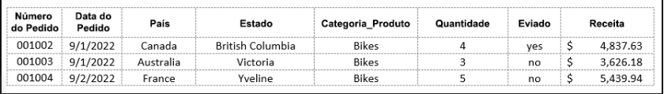

# **CURSO : INTRODUÇÃO À CIÊNCIA DE DADOS** #

>> ## Módulo04 - Exame Final : Introdução a Ciência de Dados( **4.3.1 - Item Prático : Introdução a Ciência de Dados** ) ##

### _Questões Práticas_ ##
 Obrigado por compartilhar suas opiniões sobre sua experiência com o curso de Introdução à Ciência de Dados. A pesquisa é breve e deve levar aproximadamente de 3 a 4 minutos para ser concluída. Suas respostas são confidenciais e terão um impacto real em como melhoraremos o conteúdo, as avaliações e a disponibilização do curso para futuros alunos.

 1. _Qual das seguintes descrições melhor te categoriza?_
    > Resposta : **Profissional de Nível Básico ( T.I )**

 2. _Escolha a opção abaixo que melhor descreve seu objetivo ou motivação atual em participar dos cursos da Cisco Networking Academy:_
    > Resposta : **Entrar ou progredir em uma carreira de T.I**

 3. _Avalie sua experiência geral com este curso como um todo:_
    > Resposta : **Satisfeito**

 4. _Por favor, classifique sua confiança com as habilidades gerais que você aprendeu neste curso:_
    > Resposta : **Um pouco confiante**

 5. _Por favor, avalie sua motivação para fazer bem neste curso:_
    > Resposta : **Motivado**

 6. _Ao pensar na declaração a seguir, selecione a resposta mais alinhada aos seus sentimentos. Concluir o curso valeu o tempo e o esforço que investi:_
    > Resposta : **Concordo**

 7. _Aprender habilidades que podem ser usadas no seu emprego atual ou futuro_
    > Resposta : **Talvez**

 8. _Aumentar seu valor no mercado de trabalho_
    > Resposta : **Possívelmente**

 9. _Obter um novo emprego ou progredir em seu trabalho atual_
    > Resposta : **Talvez**

 10. _Aprimorar sua educação_
        > Resposta : **Bastante** 

 11. _Pensando em toda a sua experiência com Cisco Networking Academy, qual a probabilidade de você recomendar Cisco Networking Academy para outras pessoas?_
        > Resposta : **8 ( Provável )**

 12. _O que poderia ser melhorado na Cisco Networking Academy? (selecionar uma)_
        > Resposta : **Atividade do Curso**

--------------------------------------------------------------------------

# **CURSO : INTRODUÇÃO À CIÊNCIA DE DADOS** #

>> ## Módulo04 - Exame Final : Introdução a Ciência de Dados( **4.3.1 - Exame Final : Introdução a Ciência de Dados** ) ##

### _Exame Avaliativo_ ###
 - O exame consiste em _20 perguntas_ e _70%_ são necessárias para obter seu certificado
 - Possui tentativas limitadas e tempo ilimitado

 1. _Um site de compras de e-commerce online oferece promoções ecnômicas para produtos diferentes a cada hora. Um analista de dados gostaria de analisar as vendas de produtos de dois dias antes no período da tarde. Quais são os tipos de pesquisa de consulta entre os dados de vendas?_

    > Resposta : **Date e Time**

 2. _Consulte a figura e responda cada valor atribuído a coluna e o tipo de dado_

    

    > Coluna ( *Enviado* ) : **Booleano**

    > Coluna ( *Receita* ) : **Float ( Decimal )**

    > Coluna ( *Quantidade* ) : **Integer ( Inteiro )**

    > Coluna ( *Nº de Pedido* ) : **String ( Caracteres )**

    > Coluna ( *Categorias de Produto* ) : **String ( Caracteres )**

 3. _Quais as características descrevem um Boolean data?_

    > Resposta : **Um tipo de dados que identifica um estado verdadeiro ( T ) ou estado falso ( F )**

 4. _Um gerente de vendas em uma concessionária de automóveis de grande porte deseja determinar os quatro principais modelos mais vendidos com base nos dados de vendas dos últimos dois anos. Quais são os gráficos adequados para esta finalidade?_

    > Resposta : **Gráfico de Barra | Gráfico de Coluna** 

 5. _Quais são os três tipos de dados estruturados?_

    > Resposta : **Planilha | Banco de Dados Relacional | Contas de Usuário E-commerce**

 6. _Corresponda os respectivos termos de BigData abaixo_

    > _Variedade_ : **Descreve um tipo de dados que não está pronto para processamento / analise**
    
    > _Veracidade_ : **É o processo de impedir que dados imprecisos impactam em um conjunto de dados**

    > _Velocidade_ : **Descreve a taxa na qual os dados são gerados**

    > _Volume_ : **Descreve a quantidade de dados que são transportados e armazenados** 

 7. _A alteração do formato, da estrutura ou do valor ocorre em qual fase do Pipeline de Dados_?

    > Resposta : **Transformação**

 8. _Qual é a maneira mais econômica de as empresas armazenarem o BigData?_

    > Resposta : **Armazenamento em Nuvem**

 9. _Qual é o principal desafio para o armazenamento de BigData com arquiteturas de data warehosue antigas locais?_

    > Resposta : **Eles não podem processar o volume do BigData**

 10. _O que são dados não estruturados?_

    > Resposta : **Dados que não são encaixados em linhas ou colunas de sistemas tradicionais de armazenamento de dados relacionais**

 11. _Qual é o tipo de algoritmo de aprendizado pode prever o valor de uma variável de uma taxa de juros de empréstimo com base no valor de outras variáveis?_
    
    > Respostas : **Regressão**

 12. _Qual etapa em um processo típico de aprendizado de máquina envolve testar a solução de dados de teste?_

    > Resposta : **Avaliação do Modelo**

 13. _Quais são as duas aplicações que obtenham inteligência de ratificação usando modelo de aprendizagem por reforço?_

    > Resposta : **Jogos Eletrônicos | Automação Indústrial**

 14. _Que tipo de algoritmo de aprendizado de máquina seria usado para treinar um sistema de deteção de spam de mensagens de e-mail?_
    
    > Resposta : **Modelo Supervisionado ( Classificação )**

 15. _Quais são os tipos de algoritmos de aprendizado de máquina supervisionado?_

    > Resposta : **Regressão | Classificação**

 16. _Quais são as funções normalmente atrbuídas a um Analista de Dados?_

    > Resposta : **Transformar dados brutos em informações e insights | Revisão dos Bancos de Dados e de Fontes Externas para fazer deduções sobre os números dos dados e concluir os cálculos estatísticos**

 17. _Qual é o conjunto de habilidade importantes para alguém que deseja se tornar um cientista de dados_?

    > Resposta : **Um conhecimento profundo de tecnologias de aprendizado de máquina e linguagens de programação, fortes habilidades estatísticas e analíticas e familiaridade com utilitários de softwares que facilitam o trabalho com grandes quantidades de dados**

 18. _Combine a função profissional de dados com os conjuntos de habilidades necessárias_

    > _Analista de Dados_ : **Capacidade de entender os princípios estatísticos básicos, limpeza de diferentes tipos de dados, visualização de dados e análise exploratória de dados**

    > _Cientista de Dados_ : **Capacidade de usar habilidades estatísticas e analíticas, conhecimento de programação ( R / Python / Java ) e familiaridade com o Hadoop ( um conjunto de dados utilitários de software de código aberto que facilita o trabalho com grandes quantidades de dados** 

    > _Engenheiro de Dados_ : **Capacidade de entender sobre a arquitetura e a distribuição de aquisição e armazenamento de dados, várias linguagens de programação e conhecimento do design de banco de dados ( SQL ), incluindo uma compreensão da criação e monitoramento de modelos de aprendizagem de máquina.**

 19. _Corresponda o cargo à descrição do trabalho:_

    > _Analista de Dados_ : **Aproveite ferramentas e os métodos de resolução de problemas atuais para consultar e processar dados, fornecer relatórios, resumir e visualizar dados**

    > _Cientista de Dados_ : **Aplique estatísticas, aprendizado de máquina e abordagens analíticas para intepretar e fornecer resultados visualizados para perguntas comerciais**

    > _Engenheiro de Dados_ : **Crie e operacionalize pipelines de dados para coletar e organizar dados, garantindo a acessibilidade e a disponibilidade de dados de qualidade**

 20. _Um analista de dados está criando um portifólio para futuros empregadores e deseja incluri um projeto concluído anteriormente. Quais são as documentações de processo que seriam incluídas na criação deste portifólio?_

    > Resposta : **Os métodos utilizados para analisar dados | As possíveis perguntas de pesquisa baseadas em dados e o problema de pesquisa abordados no respectivo projeto | A base para escolher o respectivo conjunto** 